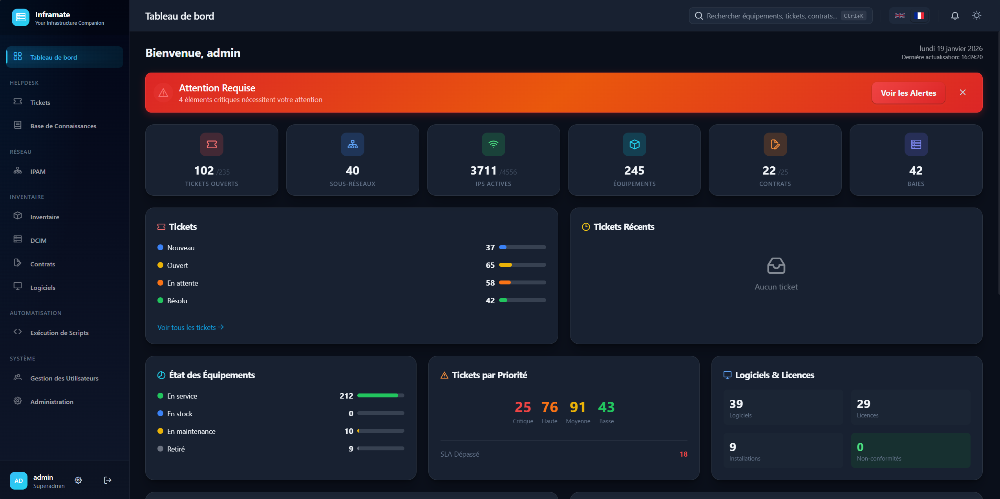
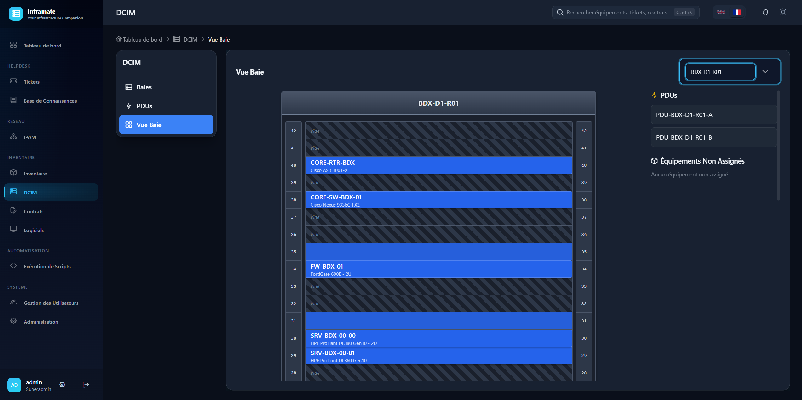
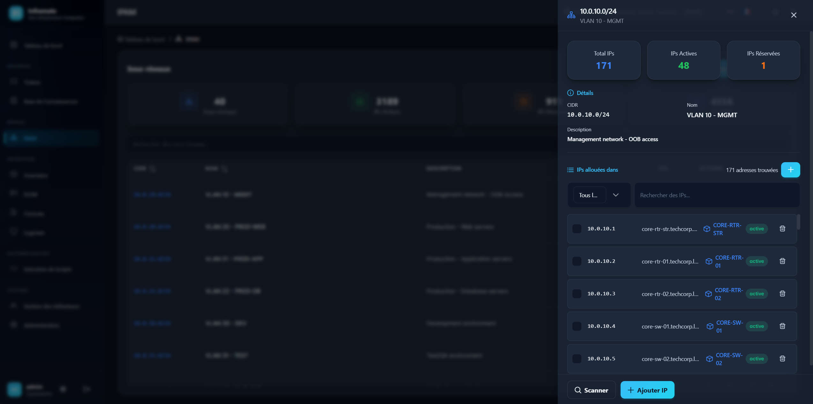
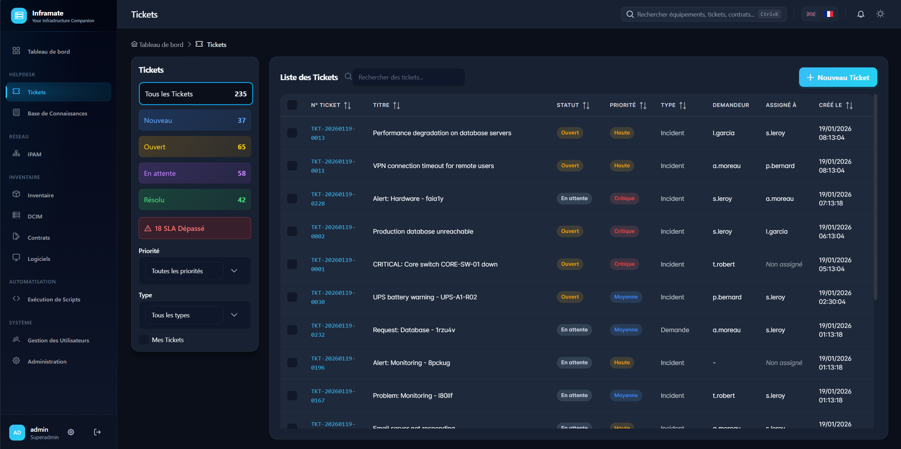
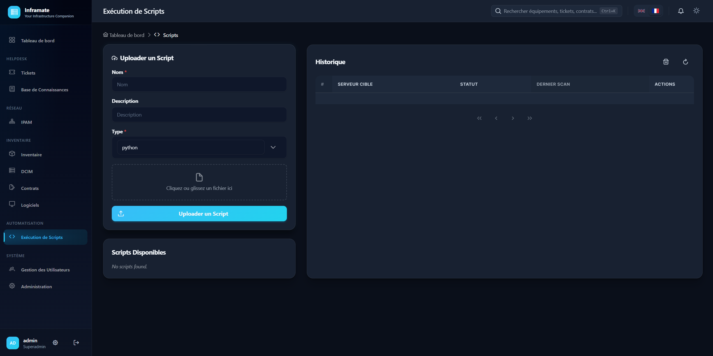
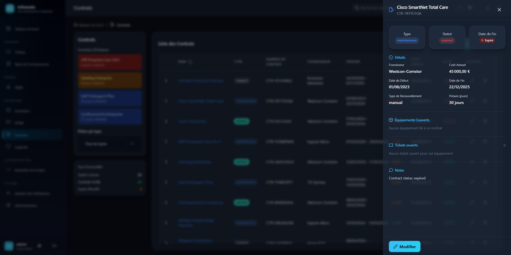

# Inframate

[](LICENSE)
[](https://www.python.org/downloads/)
[](https://vuejs.org/)
[](https://www.docker.com/)

> **"Your Infrastructure Companion"** - A self-hosted IT management platform (ITSM/ITAM)

> **Note**: This project was entirely generated by AI.

## Screenshots

Aperçu des six modules clés d'Inframate.

---

### 1. Vue d'ensemble (Dashboard)



*Grille de statistiques (tickets, sous-réseaux, IP, équipements, contrats, baies), graphiques de répartition des tickets par priorité et statut, état des équipements et indicateurs Logiciels & Licences.*

---

### 2. DCIM — Baies et positions



*Vue des baies de serveurs, positions en U et placement des équipements par glisser-déposer.*

---

### 3. IPAM — Sous-réseaux et allocation



*Liste des sous-réseaux et taux d'allocation des adresses IP.*

---

### 4. Helpdesk & Ticketing



*Liste des tickets avec badges de priorité (Critique, Haute, etc.) et indicateurs SLA — conformité ITIL.*

---

### 5. Exécution de Scripts



*Interface de lancement de scripts Python, Bash ou PowerShell dans un bac à sable Docker sécurisé.*

---

### 6. Licences & Contrats



*Tableau de bord des licences et contrats : alertes d'expiration, non-conformités — dimension ITAM.*

---

## Features

| Module | Description |
|--------|-------------|
| **Helpdesk** | ITIL ticketing (incidents, requests, problems, changes), SLA with business hours, comments, history |
| **IPAM** | Subnet management, IP allocation, automatic nmap scanning |
| **Inventory** | Equipment lifecycle, manufacturers, models, locations, suppliers, QR codes |
| **DCIM** | Rack visualization, U-position tracking, PDU management, drag-and-drop placement |
| **Contracts** | Maintenance/insurance contracts, equipment linking, expiration alerts |
| **Software** | License management, installation tracking, compliance calculation |
| **Knowledge Base** | Markdown articles, categories, feedback system, versioning |
| **Scripts** | Python/Bash/PowerShell execution in Docker sandbox, SSH/WinRM remote execution |

### Security & Administration
- JWT authentication with refresh tokens + optional TOTP 2FA
- Role hierarchy: user → tech → admin → superadmin
- Granular permissions per module
- Redis rate limiting, audit logging, Fernet encryption
- Multi-tenant support (entities)
- System settings (SMTP, security policies, maintenance mode)

## Tech Stack

| Component | Technology |
|-----------|------------|
| Backend | FastAPI + Python 3.11 + SQLAlchemy 2.0 + Celery |
| Frontend | Vue.js 3 + Pinia + PrimeVue + TailwindCSS |
| Database | PostgreSQL 15 + Redis 7 |
| Container | Docker + Docker Compose |

## Quick Start

```bash
# Clone and configure
git clone https://github.com/Arcneell/Inframate.git
cd Inframate
cp .env.example .env

# Generate required secrets
openssl rand -base64 32  # For JWT_SECRET_KEY
python -c "from cryptography.fernet import Fernet; print(Fernet.generate_key().decode())"  # For ENCRYPTION_KEY

# Start
docker-compose up --build
```

**Access:**
- Frontend: http://localhost:3000
- API Docs: http://localhost:8000/docs
- Default login: `admin` / (set via `INITIAL_ADMIN_PASSWORD`)

## Environment Variables

| Variable | Required | Description |
|----------|----------|-------------|
| `JWT_SECRET_KEY` | Yes | JWT signing key |
| `ENCRYPTION_KEY` | Yes | Fernet encryption key |
| `POSTGRES_PASSWORD` | No | DB password (default: `inframatepassword`) |
| `INITIAL_ADMIN_PASSWORD` | No | Initial admin password |
| `ALLOWED_ORIGINS` | No | CORS origins (default: `http://localhost:3000`) |

For production, use Docker secrets with `*_FILE` suffix (e.g., `JWT_SECRET_KEY_FILE`).

## Development

```bash
# Migrations
docker-compose exec backend alembic upgrade head
docker-compose exec backend alembic revision --autogenerate -m "description"

# Logs
docker-compose logs -f backend
docker-compose logs -f worker
```

## License

Elastic License 2.0 (ELv2) - see [LICENSE](LICENSE)

This license allows you to use, modify, and contribute to the software. However, you may not provide it as a hosted/managed service to third parties.

## Support

[Open an issue](https://github.com/Arcneell/Inframate/issues) on GitHub.
